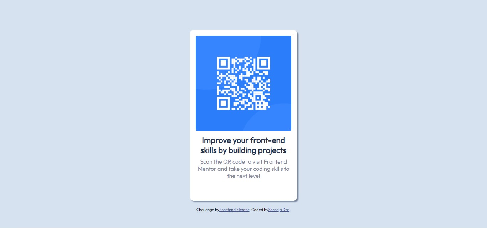

# Frontend Mentor - QR code component solution

This is a solution to the [QR code component challenge on Frontend Mentor](https://www.frontendmentor.io/challenges/qr-code-component-iux_sIO_H). Frontend Mentor challenges help you improve your coding skills by building realistic projects. 

## Table of contents

- [Overview](#overview)
  - [Screenshot](#screenshot)
  - [Links](#links)
- [My process](#my-process)
  - [Built with](#built-with)
  - [Continued development](#continued-development)
- [Author](#author)

## Overview

### Screenshot

### Links

- Solution URL: [My solution](https://github.com/shreeja4/QR-Component-Solution/tree/master)

## My process

### Built with

- Semantic HTML5 markup
- CSS custom properties
- Flexbox

### Continued development

Would focus more on the box model, block elements and flexbox properties.

## Author

- Github - [@shreeja4](https://github.com/shreeja4)
- Frontend Mentor - [@shreeja4](https://www.frontendmentor.io/profile/shreeja4)
